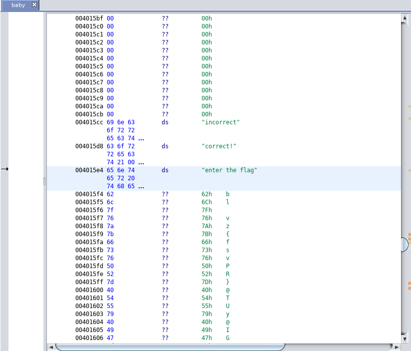
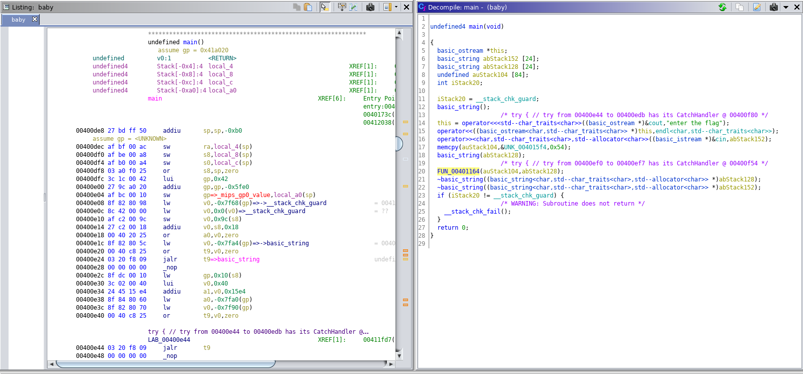

## BABYMIPS ##

Babymips is a reverse engineering challenge from UTCTF event. 

The challenge consisted of a file named _baby_

First thing I do when I am given a file, is find out its properties

```sh
$ file baby
baby: ELF 32-bit MSB executable, MIPS, MIPS32 rel2 version 1 (SYSV), dynamically linked, interpreter /lib/ld.so.1, for GNU/Linux 3.2.0, stripped

```

Given that this is a MSB executable, I was not able to run it in my Kali machine, so I just quickly jumped into reversing the file. 

When looking at the disassembly of a file, I first look at the strings to see if there is any clue. 


Looking at the strings we are able to see "incorrect", "correct!" and "enter the flag". Although these are very intriguing what gets my attention are the letters below "enter the flag". Leaving that in the back of our mind, lets continue and look at the main function of the disassembly.


I was not able to recognize any of the assembly, but good thing ghidra has a decompiler. 

```cpp
    // Promting for flag
    this = operator<<<std--char_traits<char>>((basic_ostream *)&cout,"enter the flag");
    operator<<((basic_ostream<char,std--char_traits<char>> *)this,endl<char,std--char_traits<char>>);
    // Reading from stdin
    operator>><char,std--char_traits<char>,std--allocator<char>>((basic_istream *)&cin,abStack152);
    
    // copy global variable into local variable?? Maybe??
    memcpy(auStack104,&UNK_004015f4,0x54);
    // Creating a new string??
    basic_string(abStack128);
    
    // Function call passing copied global data and the new strings as arguments... Lets take a look at this function
    FUN_00401164(auStack104,abStack128);
    ~basic_string((basic_string<char,std--char_traits<char>,std--allocator<char>> *)abStack128);
    ~basic_string((basic_string<char,std--char_traits<char>,std--allocator<char>> *)abStack152);
```
This code seems like it is just prompting the user for the flag and reading the input. It also saves global data into a local varaible (auStack104), but what its saving we saw it previously **UNK_004015f4** and it is the address of the letters we had previously seen when looking at the strings of the binary... Hmm and then the local variable where it was saved at gets passed as an argument to a function **FUN_00401164**

```cpp
void FUN_00401164(int param_1,
                 basic_string<char,std--char_traits<char>,std--allocator<char>> *param_2)

{
    int iVar1;
    basic_ostream *this;
    uint uVar2;
    char *pcVar3;
    uint uStack20;

    iVar1 = size();
    if (iVar1 == 0x4e) {
    uStack20 = 0;
    while (uVar2 = size(), uStack20 < uVar2) {
      pcVar3 = (char *)operator[](param_2,uStack20);
      if (((int)*pcVar3 ^ uStack20 + 0x17) != (int)*(char *)(param_1 + uStack20)) {
        this = operator<<<std--char_traits<char>>((basic_ostream *)&cout,"incorrect");
        operator<<((basic_ostream<char,std--char_traits<char>> *)this,
                   endl<char,std--char_traits<char>>);
        return;
      }
      uStack20 = uStack20 + 1;
    }
    this = operator<<<std--char_traits<char>>((basic_ostream *)&cout,"correct!");
    operator<<((basic_ostream<char,std--char_traits<char>> *)this,endl<char,std--char_traits<char>>)
    ;
    }
    else {
    this = operator<<<std--char_traits<char>>((basic_ostream *)&cout,"incorrect");
    operator<<((basic_ostream<char,std--char_traits<char>> *)this,endl<char,std--char_traits<char>>)
    ;
    }
    return;
}
```
This function is iterating through each character of the string xoring it by index+0x17, this might be our flag. Lets take the global string that we found earlier and write a script to decrypt it. 

```python
flag = [
0x62,0x6c,0x7f,0x76,0x7a,0x7b,0x66,0x73,0x76,0x50,0x52,0x7d,0x40,0x54,0x55,0x79,0x40,0x49,0x47,
0x4d,0x74,0x19,0x7b,0x6a,0x42,0x0a,0x4f,0x52,0x7d,0x69,0x4f,0x53,0x0c,0x64,0x10,0x0f,0x1e,0x4a,
0x67,0x03,0x7c,0x67,0x02,0x6a,0x31,0x67,0x61,0x37,0x7a,0x62,0x2c,0x2c,0x0f,0x6e,0x17,0x00,0x16,
0x0f,0x16,0x0a,0x6d,0x62,0x73,0x25,0x39,0x76,0x2e,0x1c,0x63,0x78,0x2b,0x74,0x32,0x16,0x20,0x22,
0x44,0x19
]

print(len(flag))

seed = 0x17

for i in range(len(flag)): 
    key = i+seed
    print(chr(flag[i]^key), end="")
```

And there it is the Flag
```
utflag{mips_cpp_gang_5VDm:~`N]ze;\)5%vZ=C'C(r#$q=*efD"ZNY_GX>6&sn.wF8$v*mvA@'}
```
